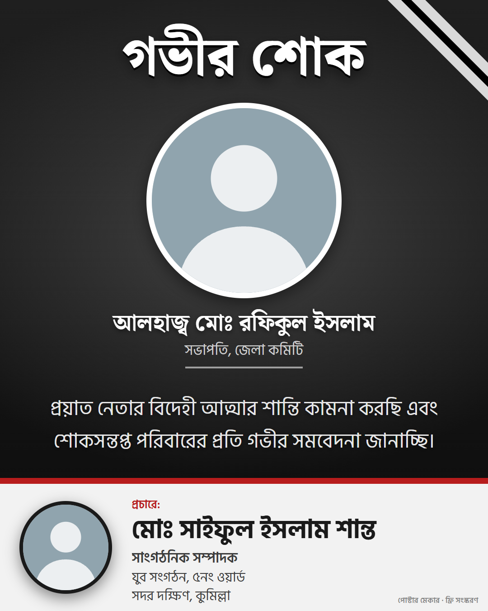
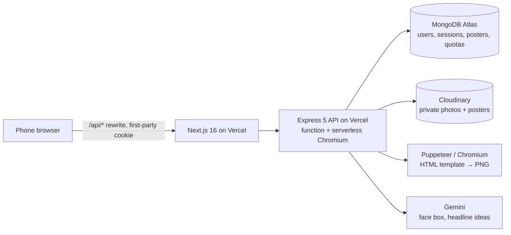

# পোস্টার মেকার — AI Political Poster Maker

Local political workers in Bangladesh fill in a short form, upload a few photos, and get a
**print-ready Bangla poster in seconds**: A3 at 300 DPI for the print shop and 4:5 for Facebook,
in the familiar Bangladeshi poster style (leader photos, flag colours, big Bangla headline,
credit bar with the publisher's name).

| Victory day (4:5) | Mourning, free tier with watermark (4:5) | Victory day (A3, preview) |
|---|---|---|
|  |  |  |

**Live demo:** https://poster-maker-web.vercel.app · Demo video: _link added after recording_

## Reviewer access

No Bangladeshi SIM needed. On the login page, use the **রিভিউয়ার এক্সেস** panel at the bottom
(or type the number yourself):

| Account | Phone | Code |
|---|---|---|
| Free (3 posters + 2 regenerations a day, watermark) | `01999000001` | `123456` |
| Premium (10 + 5 a day, no watermark) | `01999000002` | `123456` |

The first poster after a quiet spell takes a few seconds longer while the API starts Chromium.

## What it does

1. **Log in** with a phone number and a one-time code (Bangla or English digits).
2. **Pick a template** — বিজয় দিবস or শোক ও শ্রদ্ধাঞ্জলি.
3. **Fill the form**: name, পদবি, party/organization, area, headline; upload up to two leader
   photos, your own photo and an optional party symbol. Photos are cropped around the detected
   face; low-resolution photos get a warning.
4. **এআই পরামর্শ** suggests 3–5 Bangla headlines for the occasion.
5. **Generate**: the poster is ready in a few seconds. Download **A3 (3508×4961, 300 DPI)** or
   **4:5 (1080×1350)**, edit the text and regenerate, or find it later under **আমার পোস্টার**.

The whole interface is Bangla and built for phones (checked at 360 px).

## Architecture



- **Monorepo** (pnpm workspaces): `apps/web` (Next.js), `apps/api` (Express), `packages/shared`
  (Zod schemas and types used by both, so the form and the API can't drift apart).
- **Templates are data** (`layoutConfig`): element positions per output size in % of the poster
  width, text rules, colour tokens and layout variants (e.g. one or two leaders), validated by a
  schema. The API turns them into HTML; Chromium renders it.

## Key decisions

- **Bangla text is never drawn by an AI model.** Image models misspell Bangla and break
  conjuncts (যুক্তাক্ষর). Text is rendered by Chromium with bundled OFL fonts (Noto Serif/Sans
  Bengali, Hind Siliguri), so "সংগ্রাম", "শ্রদ্ধাঞ্জলি", "ক্ষ", "ন্ত্র" are always correct. AI only helps
  where it's safe: finding faces for the crop and suggesting headlines the user can edit.
  Long names shrink to fit their box (tested with 60 characters).
- **Database sessions instead of JWT.** A random token in an httpOnly, SameSite=Lax cookie; only
  its SHA-256 hash is stored. A user (or a misuser) can be logged out instantly, plan changes
  apply on the next request, and there is no token in `localStorage`. The web app proxies
  `/api/*` so the cookie is first-party.
- **Quotas are enforced atomically**: one conditional MongoDB update per request, so parallel
  requests can't exceed the limit; failed renders are refunded. Days reset at Dhaka midnight.
- **Private by default**: photos and posters are private Cloudinary assets served through
  signed URLs; photo metadata (GPS, camera) is stripped on upload; users only ever see their own
  posters (other ids return 404).

Details of every decision and trade-off: [`tech-stack.md`](tech-stack.md),
[`project-scope.md`](project-scope.md) and the running log in
[`implementation-plan.md`](implementation-plan.md).

## Quotas and tiers

| | Free | Premium |
|---|---|---|
| New posters per day | 3 | 10 |
| Regenerations (text/photo edits) per day | 2 | 5 |
| AI headline suggestions per day | 20 | 20 |
| Watermark | Small, bottom-right | None |

Re-downloading an existing poster is always free. Premium is assigned by an admin for now
(payments are out of scope); an expired premium plan counts as free.

## Guardrails

- **Keyword blocklist** on all poster text and on headline suggestions: banned militant
  organizations (also caught when spaced out or hidden with zero-width characters) and violent
  commands. It is deliberately small and non-partisan — see known limitations.
- **Rate limits** on login codes (per IP and per phone), code checks, uploads, poster changes and
  suggestions; plus a 45 s wait between codes and 5 attempts per code.
- **Terms of use** accepted at the first login, including an attestation that the user may use
  the photos and names on the poster. Every AI call and render is logged.

## Login (phone + one-time code)

Accounts are phone numbers; there are no passwords. The API keeps its own sessions (an httpOnly
`sid` cookie whose SHA-256 is stored in `sessions`), so the one-time code only proves the phone.

| Endpoint | Body | Answer |
|---|---|---|
| `POST /api/auth/otp/request` | `{ phone }` (Bangladeshi mobile, Bangla or ASCII digits) | `{ resendAfterSec, expiresInSec }` (+ `devCode` in dev mode only) |
| `POST /api/auth/otp/verify` | `{ phone, code, acceptTerms? }` | `{ user }` and the session cookie |
| `GET /api/auth/options` | – | `{ devMode, resendAfterSec, otpTtlSec, reviewer }` for the login page |
| `GET /api/auth/me` · `POST /api/auth/logout` · `POST /api/auth/logout-all` | – | current user · end this / every session |

How codes are handled ([`services/otp.ts`](apps/api/src/services/otp.ts)):

- **6 digits from `crypto.randomInt`**, stored only as `sha256(OTP_PEPPER:phone:code)` in
  `otpcodes`, with `status` (`pending` → `verified`, or `superseded` by a newer code, or `failed`
  when the SMS didn't go out), `attempts`, `expiresAt`, the requesting IP and timestamps. Rows are
  deleted a day later (TTL on `purgeAt`).
- **Valid for `OTP_TTL_SEC`** (180 s), **`OTP_MAX_ATTEMPTS` wrong guesses** (5, counted atomically,
  so parallel guesses can't get more), **used once**: a correct code is marked `verified` and can't
  log in again. A new code makes the previous one stop working.
- **Limits, stored in MongoDB** so they hold across function instances: one code per phone every
  `OTP_RESEND_COOLDOWN_SEC` (60 s, also when requests arrive at the same moment),
  `OTP_MAX_PER_PHONE_PER_HOUR` (5) and `OTP_MAX_PER_IP_PER_HOUR` (20). In-memory limiters in front
  add burst protection per instance.
- **No account enumeration:** `otp/request` answers the same for every number. Only after a
  correct code does a new number get `TERMS_REQUIRED`; the code stays usable and the login page
  shows the terms checkbox.
- **SMS through [BulkSMSBD](https://bulksmsbd.net)** ([`services/sms.ts`](apps/api/src/services/sms.ts)),
  with `BULKSMSBD_API_KEY` and `BULKSMSBD_SENDER_ID`. The code never appears in API responses or
  logs outside dev mode; SMS errors log only the provider's response code and a masked number.
- **Errors** are codes the web app shows in Bangla: `INVALID_PHONE`, `CODE_INVALID` (with
  `attemptsLeft`), `CODE_EXPIRED`, `TOO_MANY_ATTEMPTS`, `RATE_LIMITED` (with `retryAfterSec` and
  `reason: cooldown | hourly`), `TERMS_REQUIRED`, `SMS_FAILED` (provider error or timeout),
  `SMS_UNAVAILABLE` (no provider configured), `SERVICE_UNAVAILABLE` (database unreachable).

## Run it locally

Requirements: Node.js 24, pnpm 11, and (optional) accounts for MongoDB Atlas, Cloudinary and Gemini.

```bash
pnpm install
cp apps/api/.env.example apps/api/.env      # fill in what you have (see below)
cp apps/web/.env.example apps/web/.env.local
pnpm --filter @app/api seed:templates        # the two templates
pnpm --filter @app/api seed:users            # the two reviewer accounts
pnpm dev                                      # db + api (:4000) + web (:3000)
```

Open http://localhost:3000.

- **No MongoDB account?** Keep `MONGODB_URI=mongodb://127.0.0.1:27017`: `pnpm dev` then starts a
  local MongoDB (data in `apps/api/.data`).
- **Uploads** need Cloudinary keys. **Face crop and headline suggestions** need `GEMINI_API_KEY`;
  without it, photos use a centred crop and the suggestion button explains it's unavailable.
- **`OTP_DEV_MODE=true`** shows login codes in the console and on the login page instead of
  sending SMS. To send real SMS, set it to `false` and fill in the `BULKSMSBD_*` keys.
- **`querySrv ECONNREFUSED`** when connecting to Atlas: some local DNS proxies refuse SRV
  lookups. Set `DNS_SERVERS=8.8.8.8,1.1.1.1` in `apps/api/.env`.

Useful scripts:

| Command | What it does |
|---|---|
| `pnpm test` | All tests (161), including real Chromium renders |
| `pnpm typecheck` / `pnpm lint` | Types and lint for all packages |
| `pnpm --filter @app/api render:sample` | Renders every template/size/variant to `apps/api/.data/renders` |
| `pnpm --filter @app/api templates:thumbnails` | Rebuilds template thumbnails after a template change |

## Deploy

Both apps are Vercel projects built from this monorepo (`.vercelignore` keeps local `.env` files out
of CLI uploads):

- **API → `poster-maker-api`**, Root Directory `apps/api`. [`apps/api/vercel.json`](apps/api/vercel.json)
  runs `tsup` and sends every route to one function (`api/index.js` → `src/vercel.ts`, the same
  Express app without `listen()`); Chromium comes from `@sparticuz/chromium`. Env: `NODE_ENV=production`,
  `APP_ORIGIN` (the web URL), `MONGODB_URI`, Cloudinary keys, `GEMINI_API_KEY`, `OTP_PEPPER`
  (16+ random characters), reviewer numbers + code, `BULKSMSBD_API_KEY` + `BULKSMSBD_SENDER_ID`.
  `OTP_DEV_MODE` must be off: the API refuses to start in production with it. Atlas must allow
  `0.0.0.0/0`, and IP whitelisting must stay off in the BulkSMSBD panel (Vercel has no fixed IPs).
  Then run the two seed scripts against the production database, and once
  `pnpm --filter @app/api db:sync-otp-indexes` (drops the old TTL index on `otpcodes.expiresAt`).
- **Web → `poster-maker-web`**, Root Directory `apps/web`, with `API_ORIGIN` set to the API URL
  **before** the first build (the `/api` rewrite is built in).

[`render.yaml`](render.yaml) and the `Dockerfile` still describe the alternative: the API on Render
with a full Chrome.

## What was cut, and why

Scoped for one developer and a two-day deadline (see [`project-scope.md`](project-scope.md)):

- **Campaign templates** — Election Commission rules on campaign posters need checking first.
- **Payments** (bKash/Nagad) — premium exists but is assigned by an admin.
- **Admin panel, moderation queue, PDF export, bulk/CSV generation** — managed by scripts for now.
- **AI-generated backgrounds** — templates use hand-made CSS gradients.

## Known limitations

- **The blocklist is a starting list** and not a moderation system; what else belongs on it is
  the owner's decision.
- **Burst rate limits live in memory**, per function instance: Vercel can run several at once, so
  upload, poster and suggestion limits are looser than configured under load. The login-code
  limits are stored in MongoDB and hold everywhere. A shared store (e.g. Redis) would fix the rest.
- **Face crop falls back to a centred crop** when Gemini is busy; for a person standing far to
  one side this can frame the background. A manual crop control would fix it.
- **Without BulkSMSBD keys only the reviewer numbers can log in** in production (other numbers
  get `SMS_UNAVAILABLE`); dev mode, which returns codes to the browser, is local-only.
- **Print output is RGB PNG without bleed**; print shops may ask for CMYK or a 3 mm bleed.

## Next steps

Manual crop control · campaign templates after checking EC rules ·
payments · admin panel with moderation queue · shared rate-limit store · cleanup of unused uploads.
